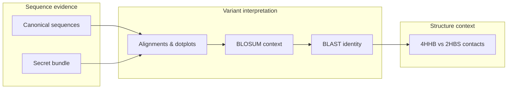

# Hemoglobin beta E6V Case Study

This repo walks the hemoglobin beta Glu6Val (E6V) story from primary sequence through structural context. It keeps the focus on the actual biology, the steps needed to reproduce the analysis, and the files you get at the end.

## Why It Exists
- **Objective:** Detect and explain the beta6 Glu->Val substitution using curated sequences, alignments, substitution matrices, BLAST confirmation, and structural context.
- **Stack:** Python 3.11+, Biopython (alignments, BLOSUM, PDB parsing), Matplotlib (figures), EMBOSS/BLAST+ (documented), py3Dmol-ready for future rendering.
- **Scientific scope:** Educational reproduction of a known variant; no novelty or clinical claims.

## The Question
- **Prompt:** Determine whether an unknown beta-globin sequence corresponds to the sickle-cell variant (E6V) by interrogating sequence QC, alignments, substitution scoring, BLAST hits, and structural context.
- **Key readouts:** percent identity vs canonical HBB, BLOSUM penalty for E->V, BLAST hit table, residue-6 contact environment in 4HHB vs 2HBS.

## Getting Set Up (Beginner Friendly)

**Environment files shipped in this repo**
- `pyproject.toml` – the list of Python dependencies used by `uv`. `uv sync` reads this file (and generates a local `uv.lock` the first time you run it).
- `environment/environment.yml` – the conda recipe that includes Python 3.11, Biopython, Matplotlib, NumPy, EMBOSS, BLAST+, and the two small pip add-ons (`py3Dmol`, `pypdf`).
- `requirements-smoke.txt` – the lean requirements list used by CI; it is handy if you just want to mimic the automated smoke test with plain `pip`.
- `uv.lock` – **not committed yet** because network-free environments cannot regenerate it. When you run `uv sync` locally it will create one for you inside the repo.

Need a slower walkthrough? See `docs/setup_for_beginners.md`.

### Step 1 – Get the repository onto your machine
- **With Git:**  
  ```bash
  git clone https://github.com/<your-account>/hemoglobin-e6v-case-study.git
  ```
  Git keeps the history, so this is the easiest option if you plan to contribute changes.
- **Without Git:**  
  Download the ZIP from GitHub (`Code` ▸ `Download ZIP`), unzip it, and a folder with all the files will appear.

### Step 2 – Open a terminal inside the project folder
Use `cd` to move into the folder you just cloned or unzipped (for example `cd hemoglobin-e6v-case-study`). Every command below assumes you are inside this folder so the scripts and data paths resolve correctly.

### Step 3 – Choose how you want to install Python packages

#### Option A – `uv` (fast, no manual activation)
1. Install `uv` if you do not already have it (`pip install uv` or follow [uv’s install guide](https://github.com/astral-sh/uv)).
2. Run:
   ```bash
   uv sync
   ```
   `uv sync` reads `pyproject.toml` (and `uv.lock` if present), downloads the pinned packages, and creates a `.venv/` folder inside the repo. The first run will also generate a local `uv.lock`. You do not need to activate anything manually—every command can be prefixed with `uv run`.

#### Option B – `conda` (or `mamba`)
1. Make sure Anaconda/Miniconda/Mamba is installed.
2. Run:
   ```bash
   conda env create -f environment/environment.yml
   ```
   That command reads the YAML file in `environment/`, builds an environment named `hemoglobin-e6v`, and installs Python plus BLAST/EMBOSS extras that live on conda-forge.
3. Activate it before running scripts:
   ```bash
   conda activate hemoglobin-e6v
   ```

If you only want the minimal packages used by CI, you can also run `pip install -r requirements-smoke.txt` in any Python 3.11 environment; it installs Biopython, Matplotlib, and NumPy (you would still need to supply BLAST+ yourself for online runs).

### Step 4 – Run the smoke test
- **uv path:** `uv run python scripts/sequence_summary.py`
- **conda path:** `python scripts/sequence_summary.py` (because the environment is already active)

The script reads the versioned FASTA files under `data/raw/{uniprot,secret_sequences}/`, then writes two outputs:
- `data/processed/sequence_summary.tsv`
- `reports/sequence_summary.md`

Verify that both files appear and mention the secret alpha/beta records. Once that works, you can run the remaining steps.

## Workflow Run Order (after setup)
The commands below assume you are either using `uv run python ...` or, if you activated the conda environment, simply `python ...`.

1. **Sequence summary** – `uv run python scripts/sequence_summary.py`  
   Parses all FASTA files and regenerates `data/processed/sequence_summary.tsv` and `reports/sequence_summary.md`.
2. **Pairwise alignments** – `uv run python scripts/run_alignments.py --gap-open 10 --gap-extend 0.5`  
   Runs the BRCA1↔53BP1 calibration plus hemoglobin vs secret alignments; writes `data/processed/alignment_summary.tsv` and plain-text alignments in `data/processed/alignments/`.
3. **QC figures** – `uv run python scripts/make_figures.py`  
   Regenerates `figures/fig01_sequence_characteristics.png` and `figures/fig06_blosum_penalty.png`.
4. **Dotplots** – `uv run python scripts/make_dotplots.py`  
   Outputs the BRCA1 calibration (`figures/fig03_dotplots_brca1_53bp1.png`) and the two hemoglobin vs secret dotplots (`figures/fig04a/b`).
5. **Canonical vs secret beta illustration** – `uv run python scripts/make_alignment_figure.py`  
   Produces `figures/fig05_beta_variant_alignment.png` with the E6V site labeled.
6. **Structural contacts** – `uv run python scripts/analyze_structure.py --radius 5.0`  
   Counts residue classes within 5 Å around beta6 and writes `data/processed/structure_contacts.csv` plus `reports/structure_summary.md`.
7. **Structure figure** – `uv run python scripts/make_structure_figure.py`  
   Generates `figures/fig08_structure_comparison.png`.
8. **BLAST artifacts** – `uv run python scripts/run_blastp.py`  
   Creates `data/processed/blast/secret_beta_query.fasta`, refreshes (or copies) `data/processed/blast/secret_beta_blast.xml`, and logs instructions in `reports/blast_protocol.md`. Use `--offline` if BLAST+ or network access is unavailable.
9. **BLAST hit visualization** – `uv run python scripts/make_blast_figure.py`  
   Converts the cached or freshly generated BLAST XML into `figures/fig07_blast_hits.png` and updates `reports/blast_summary.md`.

Outputs land under `data/processed/`, `reports/`, and `figures/`. BRCA1 vs 53BP1 remains as a "tool calibration" checkpoint; it shows how gap penalties behave on low-identity sequences before trusting the hemoglobin alignments. BLAST defaults to the cached XML if neither local BLAST+ nor outbound network is available; the cached artifact lives under `data/raw/reference/blast/`. Interaction-database interpretation is captured separately as a supporting note (see Supporting Notes & Provenance).

### Common Beginner Questions
- **Do I need Git?** No. Git makes updates easier, but downloading the ZIP from GitHub gives you the exact same files; you just need to unzip them and use `cd` to enter the folder.
- **What does `uv sync` read?** It reads `pyproject.toml` (and `uv.lock` if it exists) to learn which Python packages and versions to install. If the repo does not ship a lockfile yet, `uv sync` will create one locally after it resolves the dependencies.
- **What does `conda env create -f environment/environment.yml` read?** It reads the YAML file stored in the `environment/` folder. That file already lists the environment name (`hemoglobin-e6v`), channels (conda-forge), and packages (Python, Biopython, Matplotlib, NumPy, EMBOSS, BLAST, plus two pip extras).
- **Why do I need to activate an environment?** Activation tells your shell which Python interpreter and site-packages folder to use. Without `conda activate hemoglobin-e6v`, `python` would try to run with whatever packages happen to be installed globally, and the scripts would fail. `uv run` wraps activation for you, which is why it does not require a separate step.

## Workflow Map

1. **Canonical sequence retrieval:** pull P69905 (alpha) and P68871 (beta) from UniProt for clean references.
2. **Secret sequence comparison:** parse the curated FASTA bundle and align headers/metadata to the canonical set.
3. **Alignment:** run BRCA1<->53BP1 as a harsh control, then quantify alpha/beta identity and dotplots for the secret chains.
4. **BLOSUM interpretation:** visualize the E6V penalty relative to the canonical E->E match to ground the substitution impact.
5. **BLAST identification:** confirm the secret beta chain's nearest neighbors (HbS/Hb Monza) via reproducible BLAST XML + summary plots.
6. **Structure/function explanation:** map beta6 contacts and visualize the hydrophobic patch introduced in 2HBS vs 4HHB.

## What’s Automated vs Manual
| Step | Status | Notes |
| --- | --- | --- |
| Sequence QC & metadata (scripts/sequence_summary.py) | automated | Produces TSV + Markdown summary with length, hydrophobicity, and charge ratios. |
| Pairwise alignments (scripts/run_alignments.py) | automated | Uses Biopython pairwise2 (warned for future deprecation) with BLOSUM62; includes the BRCA1<->53BP1 calibration run. |
| QC figures (scripts/make_figures.py) | automated | Regenerates fig01 (length/hydrophobicity) and fig06 (BLOSUM penalty). |
| Canonical vs secret beta alignment (scripts/make_alignment_figure.py) | automated | Generates fig05 with residue numbering + E6V annotation directly from the tracked FASTA files. |
| Dotplots (scripts/make_dotplots.py) | automated | Produces deterministic BRCA1 calibration plots plus hemoglobin vs secret dotplots (fig03-fig04b). |
| Structural context (scripts/analyze_structure.py) | automated | Counts residue classes within 5 Angstroms of beta6 in 4HHB vs 2HBS using downloaded PDBs. |
| Structural visualization (scripts/make_structure_figure.py) | automated | Produces fig08 by plotting beta6-centered contact clouds for 4HHB vs 2HBS. |
| BLAST identification (scripts/run_blastp.py) | partially automated | Script writes the exact CLI command + query FASTA; running BLAST requires local BLAST+. Falls back to cached XML if BLAST+/network unavailable. |
| BLAST hit visualization (scripts/make_blast_figure.py) | automated (depends on XML) | Renders fig07 from `data/processed/blast/secret_beta_blast.xml`; accuracy limited by the cached BLAST snapshot. |
| Interaction-database interpretation note | manual (documented) | BioGRID vs IntAct partner counts captured once to highlight database-dependent evidence; scripting deferred (see Supporting Notes & Provenance). |

## Files You Get
| Artifact | Location |
| --- | --- |
| Sequence metrics table | `data/processed/sequence_summary.tsv`, `reports/sequence_summary.md` |
| Alignment text + summary | `data/processed/alignments/*.txt`, `data/processed/alignment_summary.tsv`, `reports/alignment_summary.md` (includes the BRCA1<->53BP1 calibration run) |
| Figures | listed above (see `figures/README.md` for captions and scripts) |
| Interaction-database interpretation note | documented manually; see Supporting Notes & Provenance |
| Structural contacts | `data/processed/structure_contacts.csv`, `reports/structure_summary.md` |
| BLAST artifacts | `reports/blast_protocol.md`, `data/processed/blast/secret_beta_query.fasta`, `data/processed/blast/secret_beta_blast.xml`, `reports/blast_summary.md` |

## Quick Interpretation Notes
- Beta-chain alignment reports 99.32% identity with a single mismatch at position 7 (beta6), matching the E6V mutation seen in BLAST hits.
- BLOSUM62 comparison shows the canonical E->E self-match (+5) vs the E->V penalty (-2), visualized in `figures/fig06_blosum_penalty.png`.
- Structural contact analysis shows beta6 surrounded by ~1.3-1.4 Angstrom hydrophobic/polar contacts in 4HHB and 2HBS, underscoring how Val6 introduces a surface hydrophobic patch (`reports/structure_summary.md`).
- For a deeper narrative (why the mutation matters, how to read each output, what conclusions are fair), see `docs/08_biological_interpretation.md`, `docs/09_results_and_discussion.md`, and `docs/05_common_misconceptions.md`.

## Release Checklist
- [x] Sequence, alignment, and structure scripts produce tracked TSV/MD outputs.
- [x] BLAST wrapper documents the exact command, caches the query sequence, and ships a fallback XML + summary for offline environments.
- [x] Generate dotplots via scripts (legacy screenshots removed).
- [x] Add CI smoke tests (see `.github/workflows/smoke.yml`).
- [ ] Replace interaction network screenshots with scripted exports (BioGRID/IntAct APIs).


## CI Smoke Test
`.github/workflows/smoke.yml` installs a lightweight Python stack (Biopython + Matplotlib) and reruns `scripts/sequence_summary.py`, `scripts/run_alignments.py`, `scripts/make_figures.py`, `scripts/make_dotplots.py`, and `scripts/analyze_structure.py` on every push/PR targeting `main`/`master`.

## Supporting Notes & Provenance
- **Interaction evidence:** one-time manual BioGRID vs IntAct comparison retained as a database interpretation note; scripting is on the roadmap.
- **Source materials:** original briefing, solution write-up, and the untouched FASTA bundle live under `docs/archive/ComputationalBio_Directives.pdf`, `docs/archive/ComputationalBio_solutions.pdf`, and `docs/archive/ComputationalBio_secret_sequences_original.fasta`.
- **Derived docs:** layered documentation lives in `docs/01_project_at_a_glance.md` through `docs/10_limitations_and_future_work.md`, plus `docs/project_brief.{md,pdf}` (public summary) and `reports/workflow_report.md` (execution log).
- **References:** `docs/references/references.bib` (e.g., Suhail 2024; Donkor et al. 2023); Biopython pairwise2 emits a deprecation warning—migrate to `Bio.Align.PairwiseAligner` when time permits.

## File Naming Conventions
- **Archive layer (`docs/archive/`)** - preserve original identifiers to keep provenance explicit.
- **Working layer (`docs/`, `reports/`, `figures/`)** - use role-based names (`project_brief`, `workflow_report`, `analysis_summary`, `blast_protocol`) for immediate context.
- **Data/outputs** - `data/{raw,processed}/<descriptive>.ext` aligning 1:1 with the generating script; figures follow `figNN_description.png` and are cataloged in `figures/README.md`.
