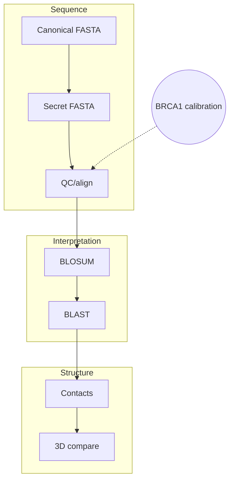

# Hemoglobin beta E6V Case Study

This repo walks the hemoglobin beta Glu6Val (E6V) story from primary sequence through structural context. It keeps the focus on the actual biology, the steps needed to reproduce the analysis, and the files you get at the end.

## Why It Exists
- **Objective:** Detect and explain the beta6 Glu->Val substitution using curated sequences, alignments, substitution matrices, BLAST confirmation, and structural context.
- **Stack:** Python 3.11+, Biopython (alignments, BLOSUM, PDB parsing), Matplotlib (figures), EMBOSS/BLAST+ (documented), py3Dmol-ready for future rendering.
- **Scientific scope:** Educational reproduction of a known variant; no novelty or clinical claims.

## The Question
- **Prompt:** Determine whether an unknown beta-globin sequence corresponds to the sickle-cell variant (E6V) by interrogating sequence QC, alignments, substitution scoring, BLAST hits, and structural context.
- **Key readouts:** percent identity vs canonical HBB, BLOSUM penalty for E->V, BLAST hit table, residue-6 contact environment in 4HHB vs 2HBS.

## How to Rerun It
```
# 0) Install dependencies (conda or uv)
uv sync  # or conda env create -f environment/environment.yml

# 1) Summarize sequences
uv run python scripts/sequence_summary.py

# 2) Run pairwise alignments (HBA/HBB/BRCA1 vs 53BP1)
uv run python scripts/run_alignments.py --gap-open 10 --gap-extend 0.5

# 3) Generate QC figures (length/hydrophobicity + BLOSUM penalty)
uv run python scripts/make_figures.py

# 4) Generate dotplots (BRCA1 calibration + hemoglobin comparisons)
uv run python scripts/make_dotplots.py

# 5) Plot canonical vs secret beta alignment (E6V)
uv run python scripts/make_alignment_figure.py

# 6) Map beta6 contacts in 4HHB vs 2HBS
uv run python scripts/analyze_structure.py --radius 5.0

# 7) Visualize beta6 neighborhood (structure scatter)
uv run python scripts/make_structure_figure.py

# 8) Prepare BLAST query + protocol (use --offline to copy the cached XML without hitting BLAST+/NCBI)
uv run python scripts/run_blastp.py

# 9) Plot BLAST hits from cached/current XML
uv run python scripts/make_blast_figure.py
```
Outputs land under `data/processed/` and `reports/`. Figures are written to `figures/fig01_sequence_characteristics.png`, `figures/fig03_dotplots_brca1_53bp1.png`, `figures/fig04a_dotplot_hba_secret.png`, `figures/fig04b_dotplot_hbb_secret.png`, `figures/fig05_beta_variant_alignment.png`, `figures/fig06_blosum_penalty.png`, `figures/fig07_blast_hits.png`, and `figures/fig08_structure_comparison.png`. BRCA1 vs 53BP1 remains as a "tool calibration" checkpoint; it shows how gap penalties behave on low-identity sequences before trusting the hemoglobin alignments. BLAST defaults to a cached XML if neither local BLAST+ nor outbound network is available; the cached artifact lives under `data/raw/reference/blast/`. Interaction-database interpretation is captured separately as a supporting note (see Supporting Notes & Provenance).

## Workflow Map
```mermaid
flowchart LR
    subgraph S[Sequence Evidence]
        A[Canonical FASTA] --> B[Secret FASTA]
        B --> C[QC + align]
        C --> D[Variant summary]
    end

    subgraph V[Variant Interpretation]
        D --> E[BLOSUM delta]
        E --> F[BLAST hits]
    end

    subgraph F[Structure & Function]
        F --> G[Contact counts]
        G --> H[3D comparison]
    end

    X{{BRCA1 calibration}} -.-> C

    classDef seq fill:#e3f2fd,color:#0d47a1,stroke:#90caf9;
    classDef var fill:#e8f5e9,color:#1b5e20,stroke:#a5d6a7;
    classDef struct fill:#fff3e0,color:#ef6c00,stroke:#ffcc80;
    class A,B,C,D seq;
    class E,F var;
    class G,H struct;
    class X fill:#f3e5f5,color:#6a1b9a,stroke-dasharray:5 5;
```
1. **Canonical sequence retrieval:** pull P69905 (alpha) and P68871 (beta) from UniProt for clean references.
2. **Secret sequence comparison:** parse the curated FASTA bundle and align headers/metadata to the canonical set.
3. **Alignment:** run BRCA1<->53BP1 as a harsh control, then quantify alpha/beta identity and dotplots for the secret chains.
4. **BLOSUM interpretation:** visualize the E6V penalty relative to the canonical E->E match to ground the substitution impact.
5. **BLAST identification:** confirm the secret beta chain's nearest neighbors (HbS/Hb Monza) via reproducible BLAST XML + summary plots.
6. **Structure/function explanation:** map beta6 contacts and visualize the hydrophobic patch introduced in 2HBS vs 4HHB.

### Alternative Workflow Views

**Minimal chain (good for slides)**


**Stacked stages (GitHub-friendly)**


## What's Automated vs Manual
| Step | Status | Notes |
| --- | --- | --- |
| Sequence QC & metadata (scripts/sequence_summary.py) | automated | Produces TSV + Markdown summary with length, hydrophobicity, and charge ratios. |
| Pairwise alignments (scripts/run_alignments.py) | automated | Uses Biopython pairwise2 (warned for future deprecation) with BLOSUM62; includes the BRCA1<->53BP1 calibration run. |
| QC figures (scripts/make_figures.py) | automated | Regenerates fig01 (length/hydrophobicity) and fig06 (BLOSUM penalty). |
| Canonical vs secret beta alignment (scripts/make_alignment_figure.py) | automated | Generates fig05 with residue numbering + E6V annotation directly from the tracked FASTA files. |
| Dotplots (scripts/make_dotplots.py) | automated | Produces deterministic BRCA1 calibration plots plus hemoglobin vs secret dotplots (fig03-fig04b). |
| Structural context (scripts/analyze_structure.py) | automated | Counts residue classes within 5 Angstroms of beta6 in 4HHB vs 2HBS using downloaded PDBs. |
| Structural visualization (scripts/make_structure_figure.py) | automated | Produces fig08 by plotting beta6-centered contact clouds for 4HHB vs 2HBS. |
| BLAST identification (scripts/run_blastp.py) | partially automated | Script writes the exact CLI command + query FASTA; running BLAST requires local BLAST+. Falls back to cached XML if BLAST+/network unavailable. |
| BLAST hit visualization (scripts/make_blast_figure.py) | automated (depends on XML) | Renders fig07 from `data/processed/blast/secret_beta_blast.xml`; accuracy limited by the cached BLAST snapshot. |
| Interaction-database interpretation note | manual (documented) | BioGRID vs IntAct partner counts captured once to highlight database-dependent evidence; scripting deferred (see Supporting Notes & Provenance). |

## Files You Get
| Artifact | Location |
| --- | --- |
| Sequence metrics table | `data/processed/sequence_summary.tsv`, `reports/sequence_summary.md` |
| Alignment text + summary | `data/processed/alignments/*.txt`, `data/processed/alignment_summary.tsv`, `reports/alignment_summary.md` (includes the BRCA1<->53BP1 calibration run) |
| Figures | listed above (see `figures/README.md` for captions and scripts) |
| Interaction-database interpretation note | documented manually; see Supporting Notes & Provenance |
| Structural contacts | `data/processed/structure_contacts.csv`, `reports/structure_summary.md` |
| BLAST artifacts | `reports/blast_protocol.md`, `data/processed/blast/secret_beta_query.fasta`, `data/processed/blast/secret_beta_blast.xml`, `reports/blast_summary.md` |

## Quick Interpretation Notes
- Beta-chain alignment reports 99.32% identity with a single mismatch at position 7 (beta6), matching the E6V mutation seen in BLAST hits.
- BLOSUM62 comparison shows the canonical E->E self-match (+5) vs the E->V penalty (-2), visualized in `figures/fig06_blosum_penalty.png`.
- Structural contact analysis shows beta6 surrounded by ~1.3-1.4 Angstrom hydrophobic/polar contacts in 4HHB and 2HBS, underscoring how Val6 introduces a surface hydrophobic patch (`reports/structure_summary.md`).

## Release Checklist
- [x] Sequence, alignment, and structure scripts produce tracked TSV/MD outputs.
- [x] BLAST wrapper documents the exact command, caches the query sequence, and ships a fallback XML + summary for offline environments.
- [x] Generate dotplots via scripts (legacy screenshots removed).
- [x] Add CI smoke tests (see `.github/workflows/smoke.yml`).
- [ ] Replace interaction network screenshots with scripted exports (BioGRID/IntAct APIs).

Once the interaction networks are scripted (or clearly cited screenshots), the repo is strong enough for GitHub/LinkedIn; until then, keep the interaction note so reviewers know the remaining manual step.

## CI Smoke Test
`.github/workflows/smoke.yml` installs a lightweight Python stack (Biopython + Matplotlib) and reruns `scripts/sequence_summary.py`, `scripts/run_alignments.py`, `scripts/make_figures.py`, `scripts/make_dotplots.py`, and `scripts/analyze_structure.py` on every push/PR targeting `main`/`master`.

## Supporting Notes & Provenance
- **Interaction evidence:** one-time manual BioGRID vs IntAct comparison retained as a database interpretation note; scripting is on the roadmap.
- **Source materials:** original briefing and early report are archived verbatim under `docs/archive/INFO-F434_assignment_original.pdf` and `docs/archive/TP2_student_report_original.pdf`.
- **Derived docs:** layered documentation lives in `docs/01_project_at_a_glance.md` through `docs/10_limitations_and_future_work.md`, plus `docs/project_brief.{md,pdf}` (public summary) and `reports/workflow_report.md` (execution log).
- **References:** `docs/references/references.bib` (e.g., Suhail 2024; Donkor et al. 2023); Biopython pairwise2 emits a deprecation warning—migrate to `Bio.Align.PairwiseAligner` when time permits.

## File Naming Conventions
- **Archive layer (`docs/archive/`)** - preserve original identifiers to keep provenance explicit.
- **Working layer (`docs/`, `reports/`, `figures/`)** - use role-based names (`project_brief`, `workflow_report`, `analysis_summary`, `blast_protocol`) for immediate context.
- **Data/outputs** - `data/{raw,processed}/<descriptive>.ext` aligning 1:1 with the generating script; figures follow `figNN_description.png` and are cataloged in `figures/README.md`.
